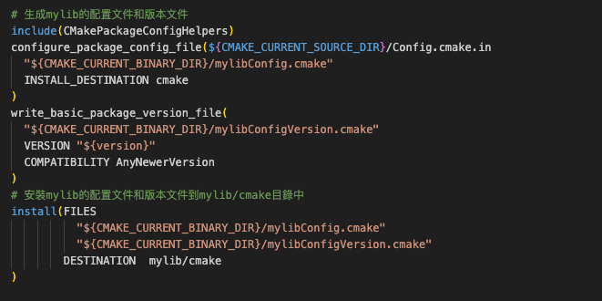

## 簡介
本專案構建了一個名為mylib的靜態庫，並提供了相應的安裝腳本以及庫的配置和版本文件，使得其他項目可以方便地使用這個庫。

### 建立mylib庫
在專案中 `libs/mylib`，首先使用PROJECT指令定義了專案名稱和版本號。然後使用file指令和GLOB_RECURSE參數列舉了源代碼文件的路徑，並使用add_library指令將這些源代碼文件構建為一個靜態庫（Static Library）mylib。

> add_library 一定要使用 STATIC


接著，使用target_include_directories指令設置了mylib庫的包含目錄，使得庫的用戶可以通過#include指令引用這些頭文件。


接下來是安裝腳本（Install Script）部分。通過install指令將構建好的庫和頭文件安裝到目標目錄中。同時使用install(EXPORT ...)指令將庫的導出文件安裝到指定位置，以便在其他CMake專案中使用。


最後使用configure_package_config_file和write_basic_package_version_file指令創建了庫的配置文件（Config）和版本文件，以方便其他專案可以使用find_package命令找到和使用mylib庫。然後將它們安裝到指定的目錄中。



## 建立一個myapp應用程式，並相依mylib庫
在本範例`src`直接透過add_subdirectory建立一個應用程式專案和一個名為mylib的庫之間的依賴關係。透過CMake腳本的建立一個myapp應用程式，並使其依賴於名為mylib的庫。

- add_subdirectory(): 將位於`../libs/mylib`路徑下的mylib庫的CMakeLists.txt文件加入到當前項目的CMake構建中。這將會在編譯過程中建立並安裝mylib庫。

- add_executable(): 將main.cpp文件編譯為一個名為myapp的可執行文件。這個可執行文件是整個項目的主要應用程式。

- target_link_libraries(): 指定了myapp可執行文件需要使用mylib庫。通過將PRIVATE關鍵字指定給此函數，它將庫的依賴關係限制在myapp可執行文件內部，而不會對外暴露。


## 使用方式
在VSCode中選擇編譯toolchain: [GCC 8.1.0 x86_64-w64-mingw323]，並選擇Install


編譯完成後輸入以下指令執行應用程式：
```sh
./build/bin/myapp
```

輸出結果：
```
7
Area of a circle: 12.560000
Area of a circle: 78.500000
```