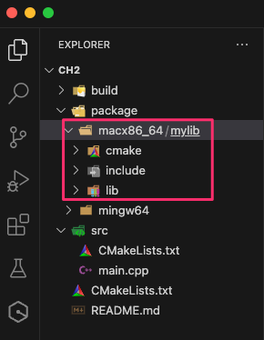
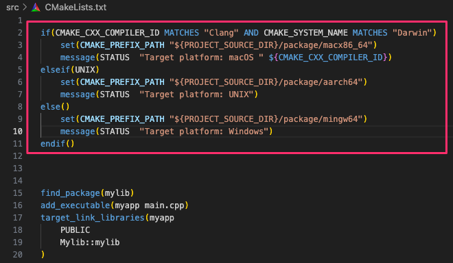
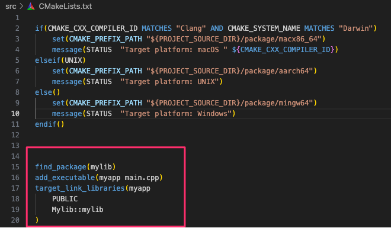

## 簡介
在本範例中將根據不同的目標平台設置 CMake 的相關路徑，然後使用 find_package 找到名為 mylib 的專案，並將其連結到目標應用程式 myapp 中。

### 搬移編譯好的庫至package
請參考 ch1 的專案將bin資料夾內根據不同toolchain編譯的庫複製到本專案package資料夾下。



### 建立一個myapp應用程式，並相依mylib庫
首先根據不同的編譯器和系統，設置適當的 CMake 前置路徑 (CMAKE_PREFIX_PATH)



接著使用 find_package() 找到名為 mylib 的專案，這將在設置的前置路徑中尋找 mylibConfig.cmake 或 mylib-config.cmake 文件。一旦找到，CMake 將使用此文件來配置 mylib 的相關屬性。最後將 mylib 連結到目標應用程式 myapp 中。



#### find_package()是如何運作的
find_package() 函數尋找庫時的查找流程：

1. 首先，會從 CMAKE_MODULE_PATH 變數所指定的路徑下尋找 Find<name>.cmake 文件。
2. 如果在第一步中沒有找到相應的文件，則會在 CMake 安裝目錄下的 /share/cmake-x.y/Modules 目錄中尋找 Find<name>.cmake 文件。
3. 如果前兩步都沒有成功，則會嘗試尋找 <Name>Config.cmake 或 <lower-case-name>-config.cmake 文件。這是按照一定的優先順序進行的。如果在某一步找到了相應的文件，就不會再往後尋找。
4. 可以通過設置相應的變數來控制某些查找順序項的關閉。

例如，如果要尋找 OpenCV 套件，那麼它的查找順序是按照以下方式進行的：
- 在 CMAKE_PREFIX_PATH 變數指定的路徑下尋找。


## 使用方式
在VSCode中選擇編譯toolchain: [GCC 8.1.0 x86_64-w64-mingw323]，不用INSTALL。但要手動搬移以編譯好的庫放置packages資料夾下。


編譯完成後輸入以下指令執行應用程式：
```sh
./build/bin/myapp
```

輸出結果：
```
7
Area of a circle: 12.560000
Area of a circle: 78.500000
```